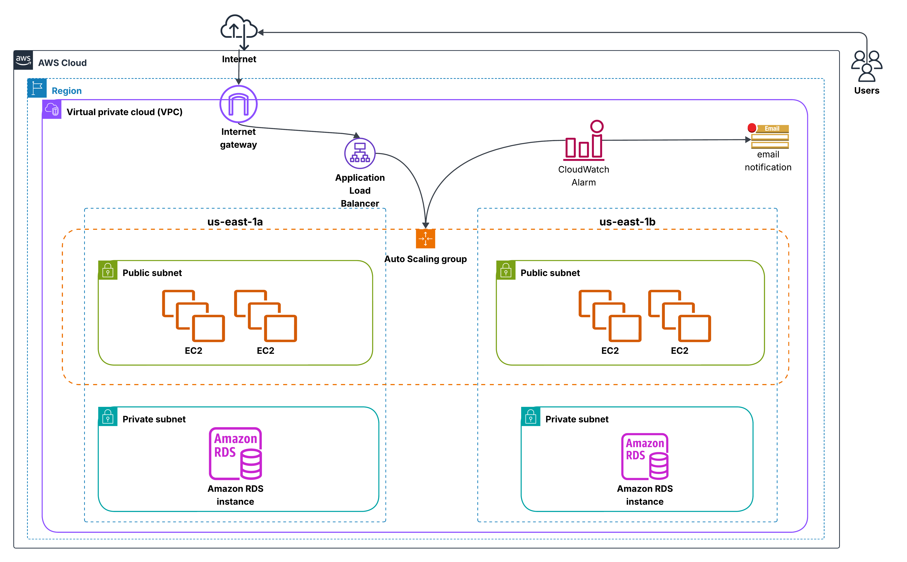

# Auto-Scaling Web Application

## Overview
A secure, highly available, and auto-scaling web application utilizing:
- EC2 instances
- Application Load Balancer (ALB)
- Auto Scaling Groups (ASG)
- Amazon RDS
- CloudWatch and SNS for monitoring

## Features

- Load-balanced traffic through ALB
- Auto scaling based on CPU utilization
- Web application hosted on EC2 instances across multiple Availability Zones
- Monitoring and notifications via CloudWatch and SNS
- RDS Multi-AZ database backend
- IAM role-based access control

---

## Architecture Diagram



---

## Deployment Guide

### 1. VPC
- Use the default VPC or create a new one
- **VPC Name**: ScalableAppVPC-vpc
- Create 2 public subnets (for EC2) and 2 private subnets (for RDS)
- Attach an Internet Gateway and configure route tables

### 2. Security Groups
- **Security Group Name**: ALP-SecurityGroups
- EC2 SG: Allow HTTP (80), HTTPS (443), SSH (22 from a specific IP)
- ALB SG: Allow HTTP/HTTPS from 0.0.0.0/0
- RDS SG: Allow database port access only from EC2 SG

### 3. IAM Role for EC2
Attach the following permissions:
- `AmazonEC2ReadOnlyAccess`
- `CloudWatchAgentServerPolicy`
- `AmazonSSMManagedInstanceCore`
- `AmazonS3Rlole`

### 4. Launch Template
- **Template Name**: web-app-template
- AMI: Amazon Linux 2 or Ubuntu
- Instance Type: `t2.micro`
- Attach IAM Role

**User Data Script:**
```bash
#!/bin/bash
yum update -y
yum install -y httpd
systemctl start httpd
systemctl enable httpd
echo "<h1>Welcome to My Scalable Web App</h1>" > /var/www/html/index.html
```

### 5. Application Load Balancer (ALB)
- **ALB Name**: web-ALB
- Listen on port 80
- Target group: EC2
- Subnets: public subnet-1, public subnet-2
- Security Group: ALP-SecurityGroups

### 6. Auto Scaling Group (ASG)
- **ASG Name**: web-ASG
- Launch Template: web-app-template
- Min Size: 2, Max Size: 5, Desired Capacity: 2
- VPC Zone Identifier: subnet-1, subnet-2
- Scale-out policy: CPU utilization > 80%

### 7. CloudWatch
Create an alarm using:
- Alarm Name: SNS Alarm
- Metric: CPUUtilization
- Threshold: 80%

### 8. RDS - Multi-AZ DB
- **Engine**: MySQL or PostgreSQL
- **Multi-AZ Deployment**: Enabled
- **VPC Name**: ScalableAppVPC-vpc
- **Public Access**: Disabled
- **Security Group**: Same as EC2
- **Connection**: Use RDS endpoint in application code

---

## Testing the Application
Access the application using the ALB DNS name:
```bash
http://web-ALB-1683263015.us-east-1.elb.amazonaws.com
```
