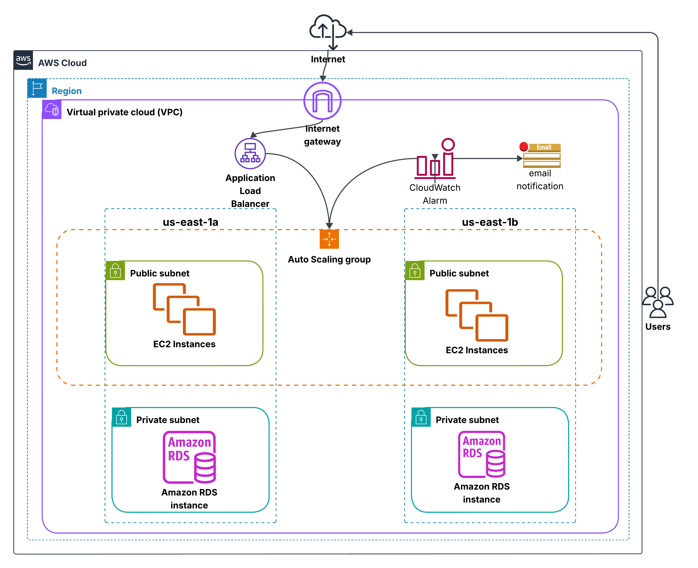

# Auto-Scaling Web Application on AWS

## Overview
A secure, highly available, and auto-scaling web application using:
- EC2 instances
- Application Load Balancer (ALB)
- Auto Scaling Groups (ASG)
- (Optional) Amazon RDS
- CloudWatch and SNS for monitoring

## Features

- Load Balanced traffic using ALB
- Auto Scaling based on CPU utilization
- Web app hosted on EC2 instances across multiple Availability Zones
- Real-time Monitoring and Notifications using CloudWatch + SNS
- (Optional) RDS Multi-AZ database backend
- IAM role-based permissions for secure access

---

## Tech Stack

- **Amazon EC2**
- **Application Load Balancer (ALB)**
- **Auto Scaling Group (ASG)**
- **CloudWatch + SNS**
- **IAM Roles**
- **Amazon RDS**

---

## Architecture Diagram



---

##  Step-by-Step Deployment Guide

### 1. **VPC Setup**
- Use **default VPC** or create a new one 
- **VPC Name**: (ScalableAppVPC-vpc)
- Public Subnets (2) for EC2 + Private Subnets (2) for RDS.
- Attach Internet Gateway and configure route tables.

### 2. **Security Groups**
- **Security Groups Name**: (ALP-SecurityGroups)
- EC2 SG: Allow HTTP (80), HTTPS (443), SSH (22 from your IP)
- ALB SG: Allow HTTP/HTTPS from anywhere (0.0.0.0/0)
- RDS SG: Allow DB ports only from EC2 SG

### 3. **IAM Role for EC2**
Attach a role with:
- `AmazonEC2ReadOnlyAccess`
- `CloudWatchAgentServerPolicy`
- `AmazonSSMManagedInstanceCore`
- `AmazonS3Rlole`

### 4. **Launch Template**
- **Launch Template Name**: (web-app-template)
- AMI: Amazon Linux 2 or Ubuntu
- Instance Type: `t2.micro`
- Attach IAM Role

Example `user-data`:
```bash
#!/bin/bash
yum update -y
yum install -y httpd
systemctl start httpd
systemctl enable httpd
echo "<h1>Welcome to My Scalable Web App</h1>" > /var/www/html/index.html
```

### 5. Create Application Load Balancer (ALB)
- **ALB Name**: (web-ALB)
- Listener on port 80
- Target group: EC2
- subnets: public subnet-1, public subnet-2 
- security-groups: ALP-SecurityGroups

### 6. Create Auto Scaling Group (ASG)
- **ASG Name**: (web-ASG)
- auto-scaling-group-name web-asg 
- launch-template "LaunchTemplateName = web-app-template
- min-size 2 , max-size 5 , desired-capacity 2 
- vpc-zone-identifier "subnet-1,subnet-2" 
- Scale-out policy (CPU >80%)

### 7. CloudWatch Alarm
- aws cloudwatch put-metric-alarm 
- alarm name:  SNS Alarm 
- metric-name CPUUtilization 
- threshold 80 

---

## Testing the App
- Visit ALB DNS name
```bash
	http://web-ALB-1683263015.us-east-1.elb.amazonaws.com
```


## Connect with Me

[](https://www.linkedin.com/in/mohamed-elhariry-/)
```bash
[LinkedIn] : (https://www.linkedin.com/in/mohamed-elhariry-/)
```