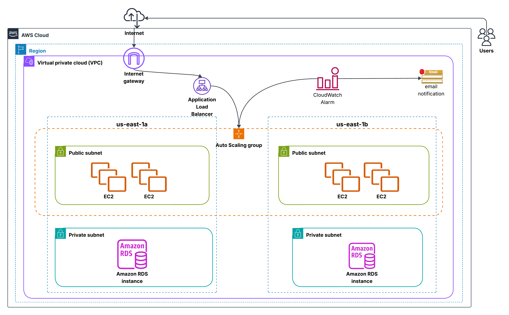
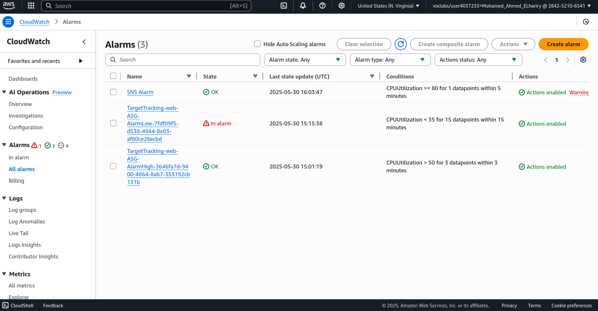

# Project Diagrams and Screenshots

**Visual Documentation of the AWS Scalable Web Application Infrastructure**

---

## 1. Architecture Diagram

High-level overview of the infrastructure components.

---

## 2. VPC Setup

Custom Virtual Private Cloud with isolated networking components.

---

## 3. Subnet Configuration

- **2 Public Subnets** (for EC2 Instances)
- **2 Private Subnets** (for RDS Database)

---

## 4. Security Groups

- **EC2 Security Group**: Allows HTTP (80), HTTPS (443), and SSH (22)
- **ALB Security Group**: Allows inbound traffic from the internet

---

## 5. Launch Template / EC2 Configuration

- **AMI**: Amazon Linux 2  
- **Instance Type**: `t2.micro`  
- **User Data**: Web server installation script (e.g., Apache/Flask setup)

---

## 6. EC2 Instances

Instances automatically launched and managed by Auto Scaling Group.

---

## 7. Application Load Balancer (ALB)

- **Internet-facing**  
- **Port**: 80 (HTTP)  
- **Target Group**: Points to EC2 Instances

---

## 8. Auto Scaling Group (ASG)

- **Min**: 2, **Desired**: 2, **Max**: 5  
- **Scaling Policy**: Based on CPU Utilization

---

## 9. Amazon RDS (Multi-AZ)

- **Engine**: MySQL or PostgreSQL  
- **Deployment**: Multi-AZ for high availability  
- **Access**: Private subnets only, no public access

---

## 10. Monitoring with CloudWatch & SNS

- CloudWatch Alarms to monitor CPU usage  
- SNS Topic for sending email notifications

---

## 11. Alarm Actions

- **Scale Out**: CPU > 80%  
- **Scale In**: CPU < 30%  
- **Notifications**: Email alerts via SNS

---

## 12. Web Application - Live Test

Website successfully accessed using the ALB DNS name.

