# Project Diagrams and Screenshots

Visual documentation of the AWS scalable web application infrastructure.

---

## 1. Architecture Diagram

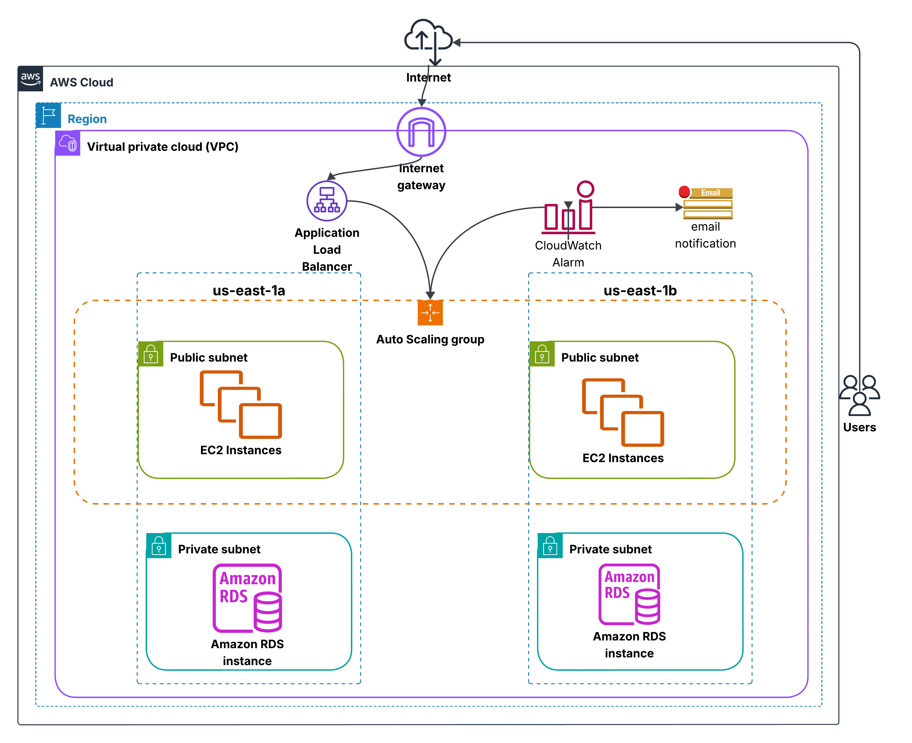

---

## 2. VPC Setup

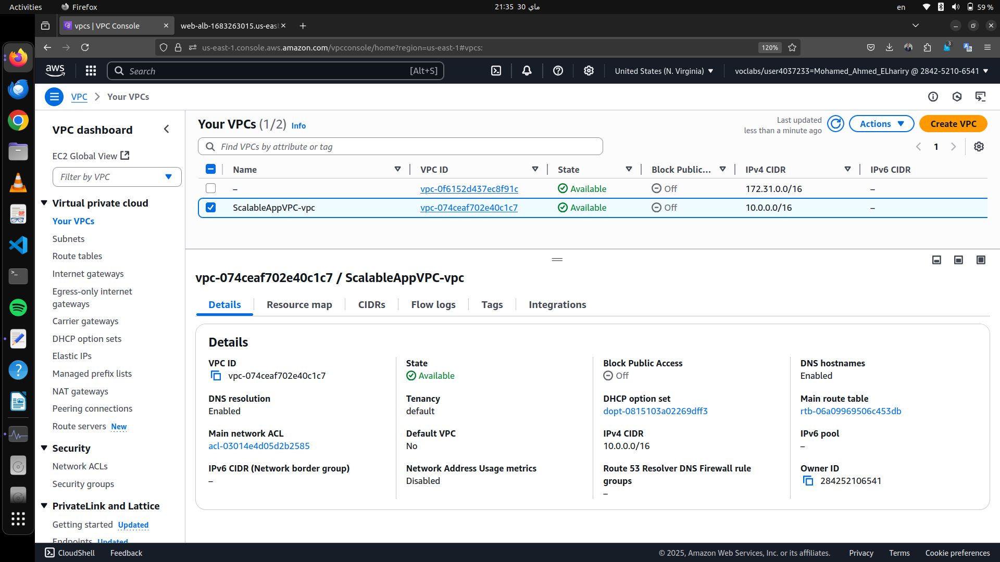

---

## 3. Subnets Configuration

- Two public subnets (EC2)
- Two private subnets (RDS)

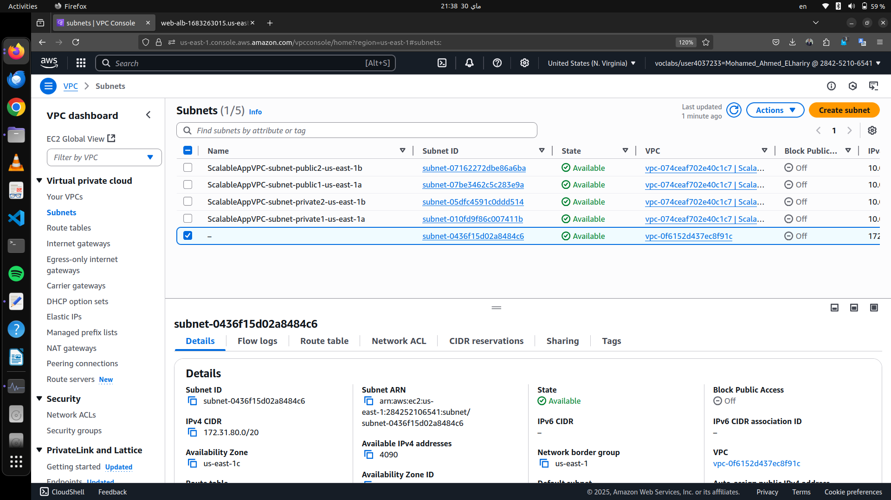

---

## 4. Security Groups

- EC2 SG for HTTP/HTTPS/SSH
- ALB SG for public access

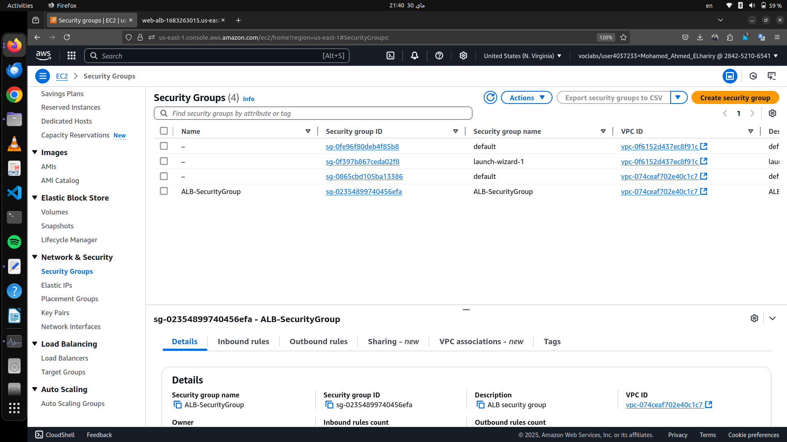

---

## 5. Launch Template or EC2 Configuration

- AMI: Amazon Linux 2
- Instance type: `t2.micro`
- User data to install web server

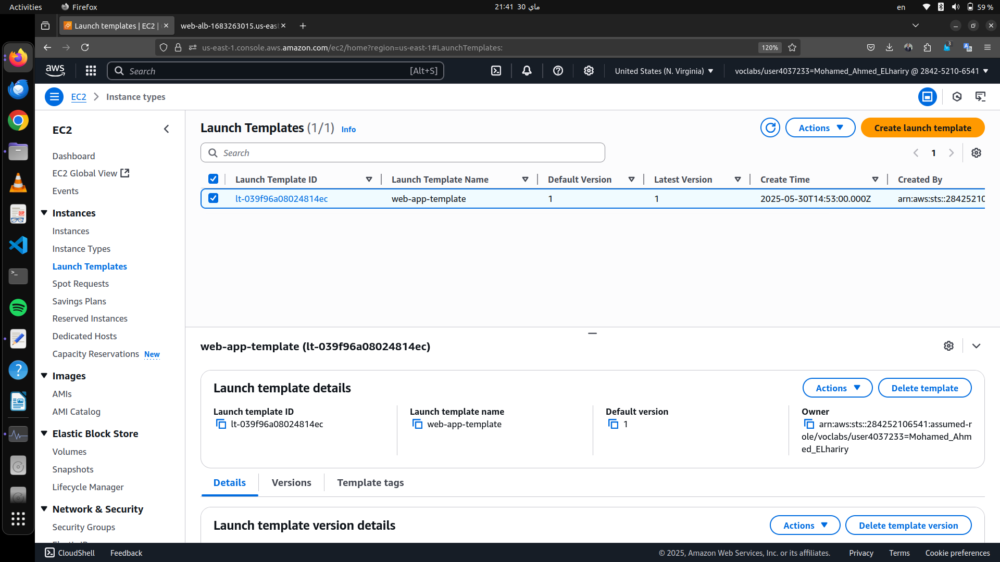

---

## 6. EC2 Instances

- Managed by Auto Scaling Group

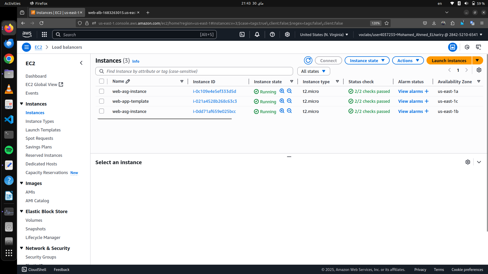

---

## 7. Application Load Balancer (ALB)

- Internet-facing
- Listener on port 80
- Target group: EC2

---

## 8. Auto Scaling Group (ASG)

- Min: 2, Desired: 2, Max: 5
- CPU-based scaling policy

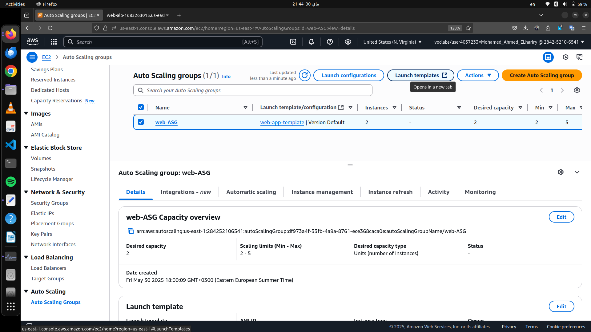

---

## 9. Amazon RDS (Multi-AZ)

- MySQL/PostgreSQL engine
- Private subnet
- No public access

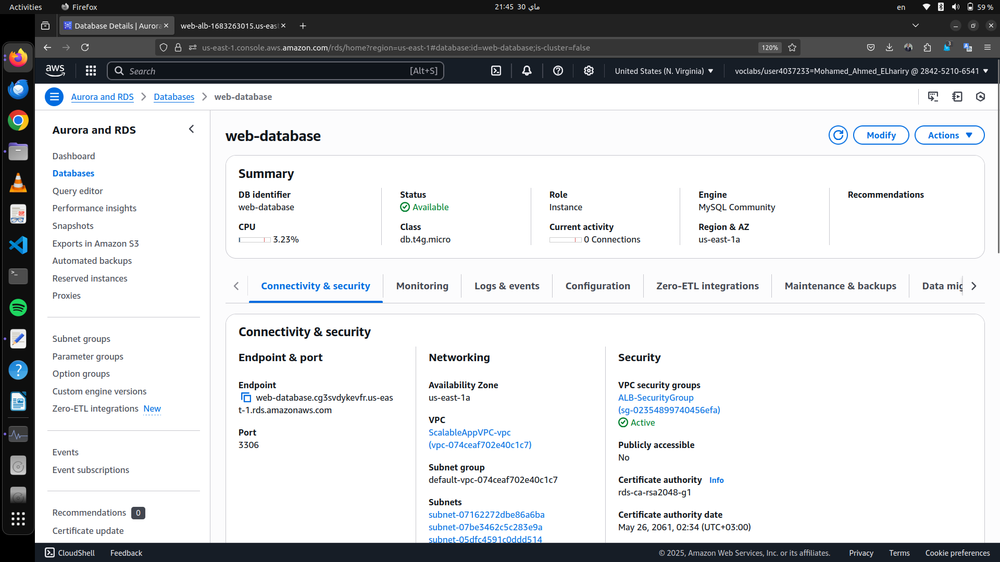

---

## 10. CloudWatch and SNS Monitoring

- Alarms based on CPU usage
- SNS Topic created and email subscribed

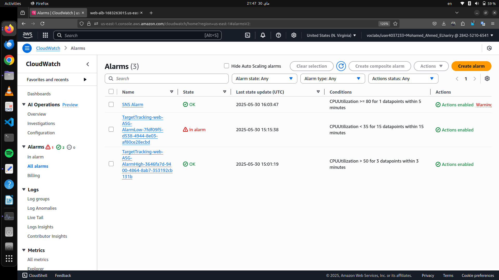

---

## 11. Alarm Actions

- Scale out: CPU > 80%
- Scale in: CPU < 30%
- Email notifications via SNS

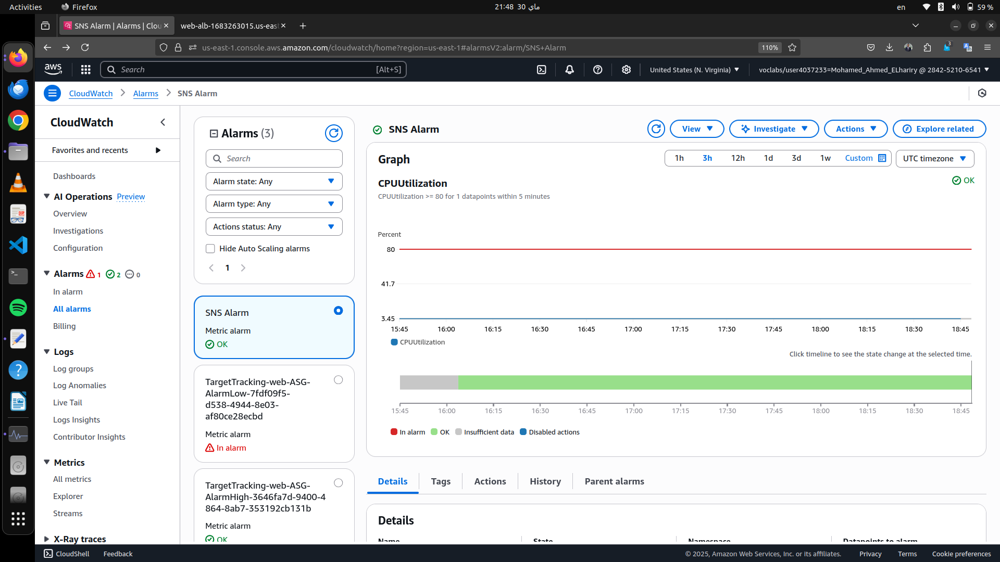

---

## 12. Web Page - Testing the Application

Accessed via the ALB DNS name

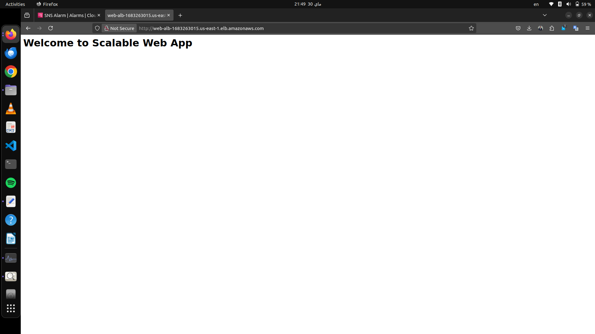

---
